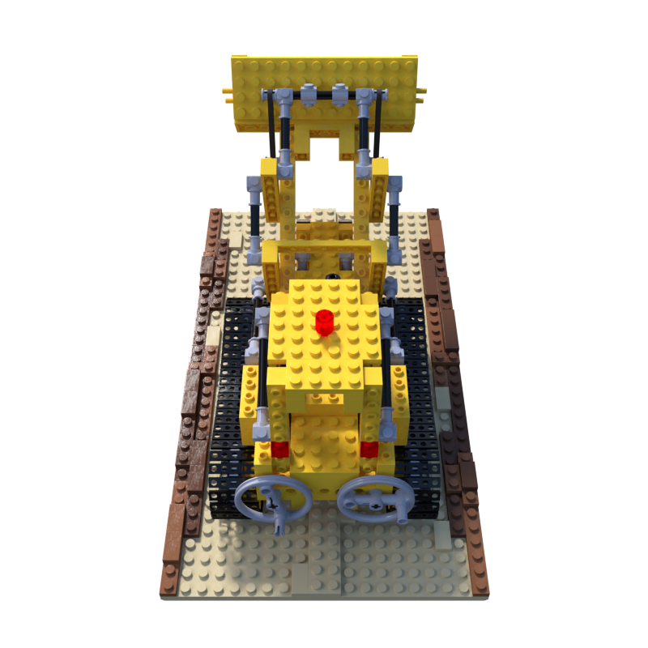
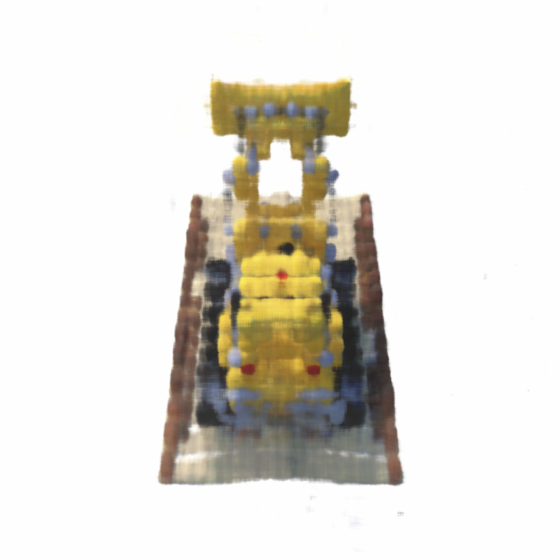
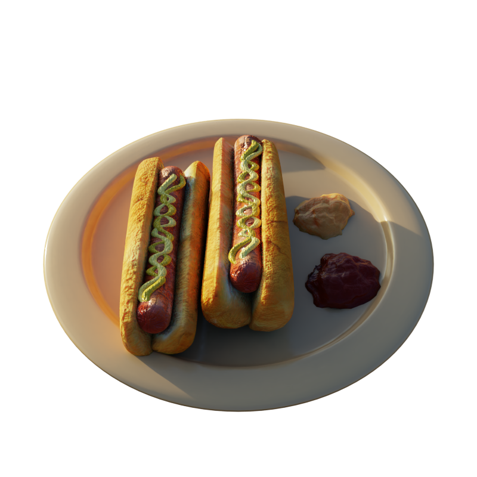
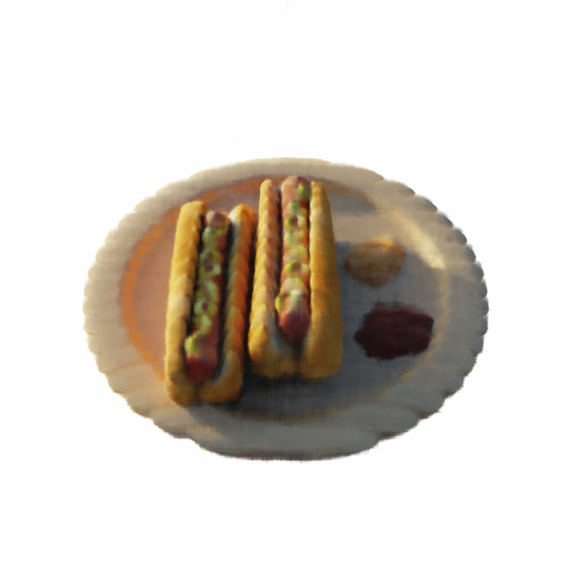

# NeRF-from-basics

---

## Architecture and Core Technical Concepts

To successfully train the network to synthesize novel views from sparse 2D images, the pipeline relies on three main foundational steps:

### 1. Ray Generation
For each pixel in a target image, a camera ray $\\mathbf{r}(t) = \\mathbf{o} + t\\mathbf{d}$ is cast into the 3D space, where $\\mathbf{o}$ is the camera origin and $\\mathbf{d}$ is the unit direction vector calculated using camera intrinsics and extrinsics (poses).

### 2. Positional Encoding
Deep networks inherently struggle to learn high-frequency details, biased instead toward low-frequency functions. To overcome this, the continuous coordinates are mapped to a higher-dimensional space using periodic functions before being fed to the MLP:

$$\\gamma(p) = \\left( \\sin(2^0\\pi p), \\cos(2^0\\pi p), \\dots, \\sin(2^{L-1}\\pi p), \\cos(2^{L-1}\\pi p) \\right)$$

This implementation utilizes $L = 10$ for 3D positions and $L = 4$ for viewing directions.

### 3. Volume Rendering Integrals
To determine the color of a single pixel, points are sampled along the corresponding ray. The continuous volume rendering integral is approximated using numerical quadrature:

$$\\hat{C}(\\mathbf{r}) = \\sum_{i=1}^{N} T_i \\left( 1 - \\exp(-\\sigma_i \\delta_i) \\right) \\mathbf{c}_i$$

Where:
* $T_i = \\exp \\left( -\\sum_{j=1}^{i-1} \\sigma_j \\delta_j \\right)$ is the accumulated transmittance.
* $\\delta_i = t_{i+1} - t_i$ is the distance between adjacent sample points.
* $\\sigma_i$ and $\\mathbf{c}_i$ are the network's predictions for density and color at that sample point.

---

## Implementation Details

* **Framework:** PyTorch (custom ray casting, sampling, and rendering loops).
* **Network:** Multilayer Perceptron (MLP) mapping 5D inputs to color and density.
* **Sampling Strategy:** Stratified sampling along rays to ensure continuous volume coverage during optimization.
* **Loss Function:** Total Mean Squared Error (MSE) between the rendered pixel colors $\\hat{C}(\\mathbf{r})$ and the ground-truth pixel colors $C(\\mathbf{r})$.

---

## Outputs and Visual Results

*(Add your generated GIFs or images here to showcase the novel views synthesized by your model)*

| Ground Truth Image | Model Rendered View |
| :---: | :---: |
|  |  |
| :---: | :---: |
|  |  |

Due to computational limitations and constrained training durations, the model-rendered output exhibits lower fidelity and sharpness relative to the ground truth. Further training iterations and hyperparameter optimization would diminish artifacts and improve fine structural reconstruction.
---

## References

* Mil
